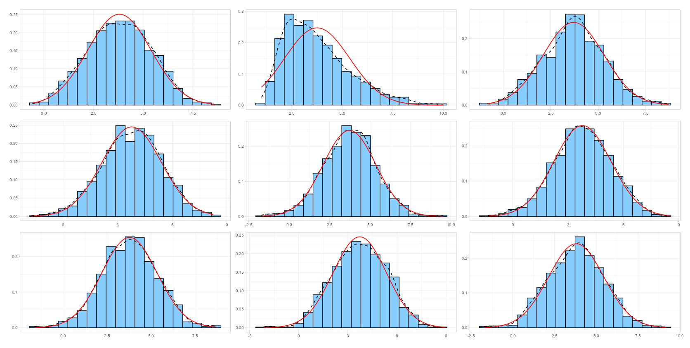

## Overview

**exsampler** is a tool to assist visual inspection of (non)normality. It displays a 3x3 grids of either histograms, QQ plots, detrended QQ plots, or PP Plots where one randomly assigned plot contains a chosen variable and the eight other plots contain data sampled from simulated normal distributions with the same number of observations, mean, and standard deviation (and optionally, the same rounding).

Plots from simulated data help calibrate the user's eyes for visually inspecting the distribution of their data. Selecting a plot reveals the location of the real data.

This application is intended for educational purposes and not meant for formal assessment of normality.

**Read more:** - [Get started](articles/exsampler-get-started.html) - [References](articles/exsampler-references.html)

